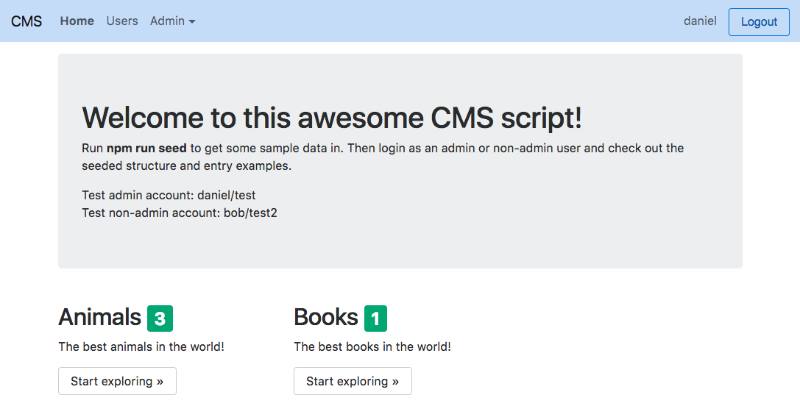
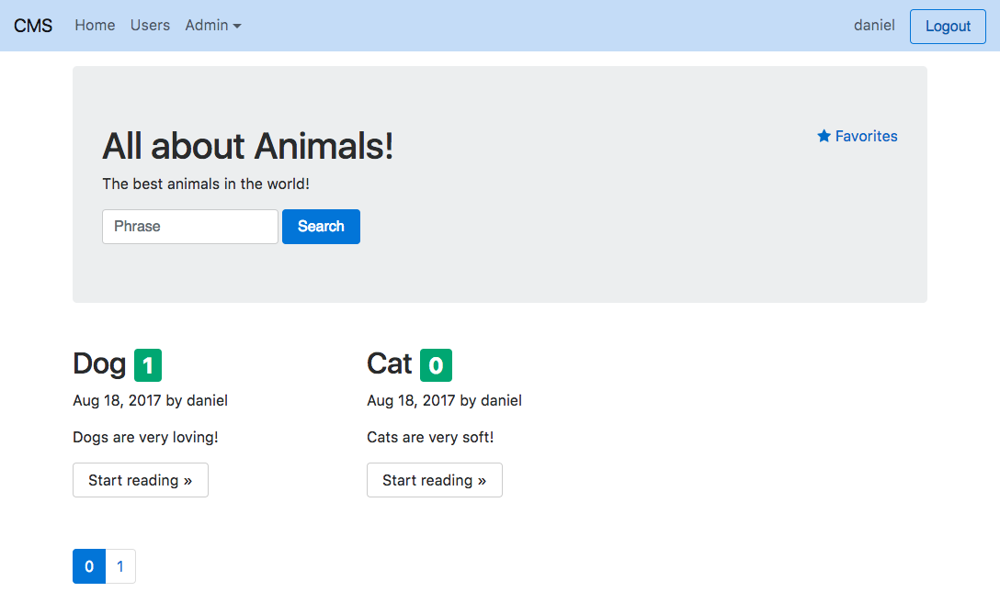
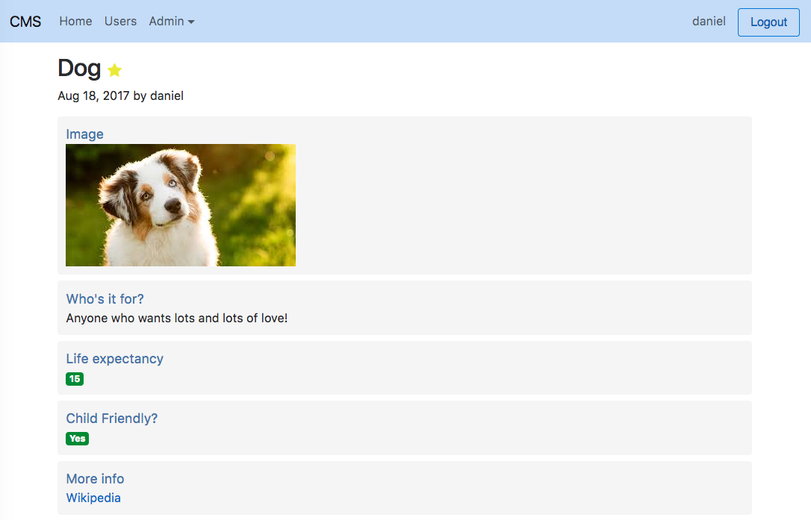
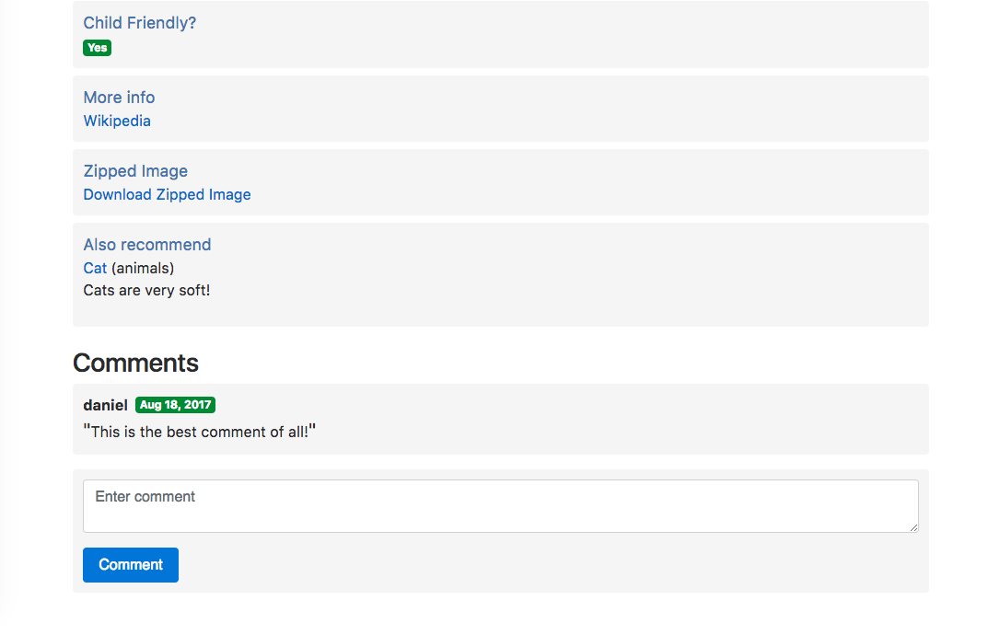
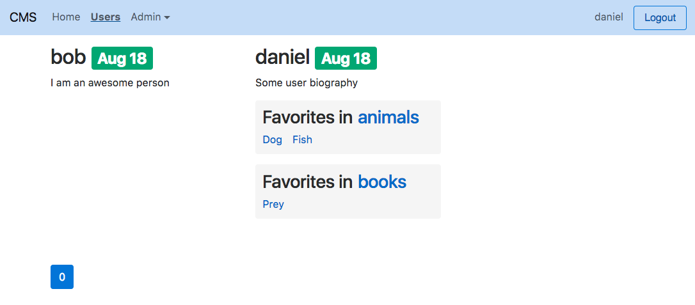
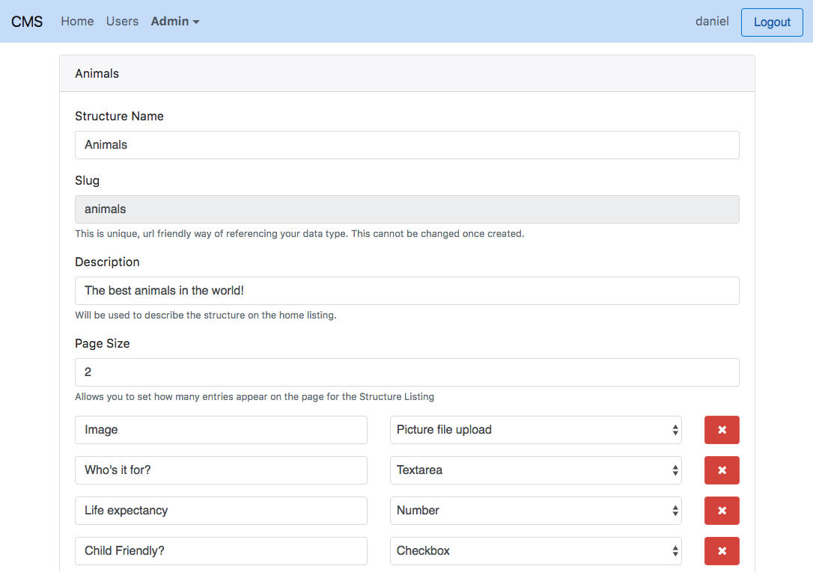
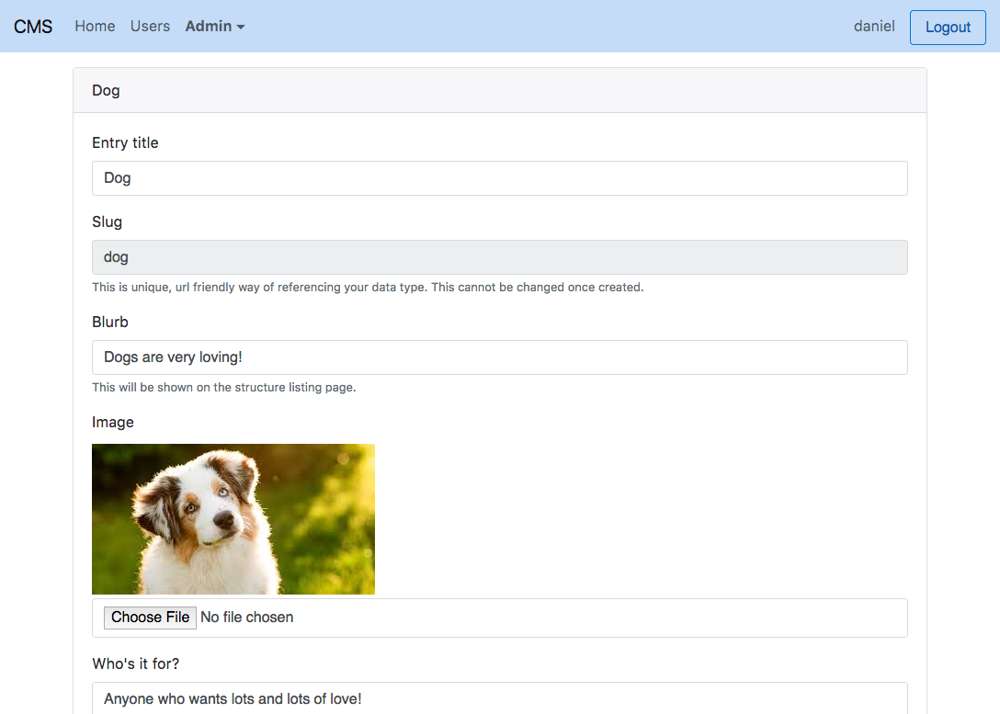
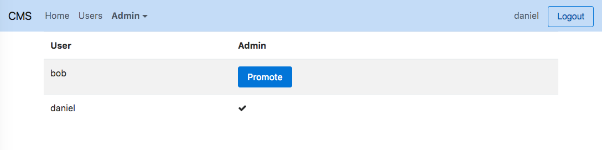

# CMS Script

Basic Single-Page-Application CMS script built using Node, React, Mongo, and ElasticSearch.

Three processes are used
- App
- API
- DB worker

Build upon the idea of configurable data structures. Each data structure is known as a _structure_ and each document within the structure is an _entry_.

### Supported structure field types
- Small text input
- A number
- Checkbox
- Textarea
- Picture file upload
- A link to another page, which will require a title and a URL
- A WYSIWYG Editor
- A datepicker
- An embeddable Youtube Video
- A reference to another Entry. This can be an Entry of any Structure Type. The Entry’s Title, Blurb, and Type will be displayed on the Entry Page.
- A downloadable file. This will be a file that the user uploads, which will get zipped up. Readers may then download the zip file.

### Admin Features
- Create, Update, Delete structures
- Create, Update, Delete entries
- Promote Users to admin

### User Features
- Signup & Login
- Comment
- Favorite

## To install
1. Download zip or `git clone https://github.com/danielheyman/CMS-Script.git`
2. Install mongodb (`brew install mongodb`)
3. Install elasticsearch (`brew install elasticsearch`)
4. Run `npm install`
5. Optional: Run `npm run seed` to get sample data to play around with
6. Run `npm start` to run the script
7. Visit `http://localhost:3000/`

## Screenshots

### Home

### Structure Listing

### Entry Page

### Users Listing

### Admin: Structure Editing

### Admin: Entry Editing

### Admin: User Management

